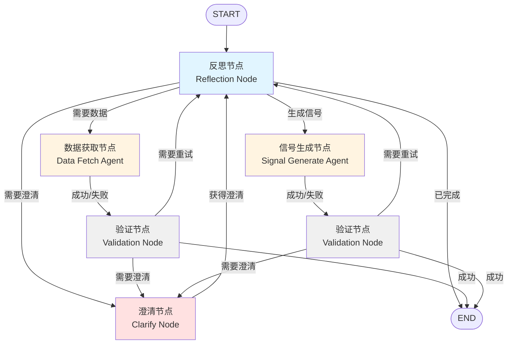

# 信号生成子图设计方案

## 目录
- [一、概述](#一概述)
- [二、子图State设计](#二子图state设计)
- [三、节点设计](#三节点设计)
- [四、路由逻辑](#四路由逻辑)
- [五、子图结构](#五子图结构)
- [六、Prompt模板](#六prompt模板)
- [七、关键设计要点](#七关键设计要点)
- [八、与主图集成](#八与主图集成)
- [九、优势分析](#九优势分析)

---

## 一、概述

本方案设计一个基于LangGraph的信号生成子图，用于实现从数据获取到交易信号生成的完整流程。子图采用ReAct（Reasoning + Acting）模式，结合反思机制和human-in-the-loop，确保稳健性和用户交互体验。

### 核心功能
1. **数据获取**：通过工具获取OHLCV和指标数据
2. **信号生成**：使用PythonAstREPLTool根据策略生成交易信号
3. **反思路由**：智能识别用户意图并调度任务
4. **用户澄清**：当信息不足时触发human-in-the-loop
5. **数据验证**：确保数据和信号的质量

---

## 二、子图State设计

### SignalSubgraphState 结构

```python
from typing import Annotated
from typing_extensions import TypedDict
from langgraph.graph.message import add_messages

class SignalSubgraphState(TypedDict):
    """信号生成子图的专用State"""
    
    # 继承主图的消息流
    messages: Annotated[list, add_messages]
    
    # 任务追踪
    current_task: str  # 当前执行的任务类型：'data_fetch', 'signal_gen', 'validate', 'clarify'
    
    # 数据状态标记
    data_ready: bool  # OHLCV数据是否已准备
    indicators_ready: bool  # 指标数据是否已准备
    signal_ready: bool  # 交易信号是否已生成
    
    # 意图识别结果
    user_intent: dict  # 包含：{type: str, params: dict, needs_clarification: bool}
    
    # 澄清相关
    clarification_needed: str | None  # 需要澄清的问题
    clarification_count: int  # 澄清次数计数
    
    # 执行历史和错误追踪
    execution_history: list[str]  # 记录已执行的步骤
    error_messages: list[str]  # 记录错误信息
    
    # 最大重试次数
    max_retries: int
    retry_count: int
```

### State字段说明

| 字段 | 类型 | 用途 |
|------|------|------|
| `messages` | `list` | LangGraph消息流，用于保存对话历史 |
| `current_task` | `str` | 标记当前执行的任务类型，用于路由决策 |
| `data_ready` | `bool` | 标记OHLCV数据是否已加载到GLOBAL_DATA_STATE |
| `indicators_ready` | `bool` | 标记指标数据是否已加载 |
| `signal_ready` | `bool` | 标记交易信号是否已生成 |
| `user_intent` | `dict` | 存储反思节点解析的用户意图和参数 |
| `clarification_needed` | `str \| None` | 需要向用户澄清的问题文本 |
| `clarification_count` | `int` | 已发起的澄清次数，用于防止无限循环 |
| `execution_history` | `list[str]` | 记录已执行的步骤，用于避免重复错误 |
| `error_messages` | `list[str]` | 收集执行过程中的错误信息 |
| `max_retries` | `int` | 最大重试次数（默认3次） |
| `retry_count` | `int` | 当前重试计数 |

---

## 三、节点设计

### 节点架构总览

```
┌─────────────────┐
│  Reflection     │  中央调度器，识别意图，决策路由
│  反思节点        │  工具: PythonAstREPLTool
└─────────────────┘
         ↓
    ┌────┴────┐
    ↓         ↓
┌──────────┐ ┌──────────┐
│Data Fetch│ │  Signal  │  执行节点，使用ReAct模式
│数据获取   │ │  Gen     │  工具: 各自专用工具集
└──────────┘ └──────────┘
    ↓             ↓
┌─────────────────┐
│   Validation    │  验证节点，检查数据和信号质量
│   验证节点       │  工具: PythonAstREPLTool
└─────────────────┘
         ↓
┌─────────────────┐
│    Clarify      │  澄清节点，触发human-in-the-loop
│    澄清节点      │  特性: interrupt()
└─────────────────┘
```

### 1. 反思节点 (Reflection Node)

**职责**：
- 分析用户输入，识别任务类型（数据获取/信号生成/混合）
- 检查GLOBAL_DATA_STATE中的数据状态
- 决策下一步路由方向（数据获取/信号生成/澄清/验证/结束）
- 使用PythonAstREPLTool快速验证数据

**工具**：
- `PythonAstREPLTool`：用于快速验证GlobalDataState中的数据

**输入**：
- 用户消息（从`state['messages']`获取）
- 执行历史（`state['execution_history']`）
- 错误信息（`state['error_messages']`）
- 数据状态标记

**输出**：
- 更新`user_intent`：解析的用户意图和参数
- 更新`current_task`：下一步要执行的任务
- 更新`clarification_needed`：如果需要澄清

**实现方式**：
```python
def reflection_node(state: SignalSubgraphState):
    from src.llm import get_llm
    from langchain_experimental.tools.python.tool import PythonAstREPLTool
    from langgraph.prebuilt import create_react_agent
    
    # 创建数据验证工具
    py_tool = PythonAstREPLTool(
        name="python_repl",
        description="用于验证GlobalDataState中的数据状态",
        globals={"GLOBAL_DATA_STATE": GLOBAL_DATA_STATE, "pd": pd}
    )
    
    # 使用ReAct agent进行反思
    agent = create_react_agent(get_llm(), tools=[py_tool])
    
    # 填充prompt并执行
    prompt = REFLECTION_NODE_PROMPT.format(...)
    result = agent.invoke({"messages": [{"role": "user", "content": prompt}]})
    
    # 解析结果并更新state
    # ...
    
    return state
```

---

### 2. 数据获取节点 (Data Fetch Agent)

**职责**：
- 根据用户需求调用数据获取工具
- 自主决策调用顺序（先OHLCV，后指标）
- 处理数据获取错误并反馈
- 确认数据成功存入GLOBAL_DATA_STATE

**工具**：
- `tushare_daily_bar_tool`：获取OHLCV日线行情
- `tushare_daily_basic_tool`：获取每日指标数据

**输入**：
- `user_intent['params']`：包含股票代码、时间范围、需要的指标

**输出**：
- 更新`data_ready`：OHLCV数据已准备
- 更新`indicators_ready`：指标数据已准备（如果获取了）
- 追加`execution_history`：记录数据获取步骤
- 追加`error_messages`：如果有错误

**实现方式**：
```python
def data_fetch_node(state: SignalSubgraphState):
    from src.llm import get_light_llm
    from src.tools.daily_bar import tushare_daily_bar_tool
    from src.tools.daily_ind import tushare_daily_basic_tool
    from langgraph.prebuilt import create_react_agent
    
    # 创建数据获取agent
    tools = [tushare_daily_bar_tool, tushare_daily_basic_tool]
    agent = create_react_agent(get_light_llm(), tools=tools)
    
    # 填充prompt
    prompt = DATA_FETCH_AGENT_PROMPT.format(
        ts_code=state['user_intent']['params'].get('ts_code'),
        start_date=state['user_intent']['params'].get('start_date'),
        end_date=state['user_intent']['params'].get('end_date'),
        required_indicators=state['user_intent']['params'].get('required_indicators', [])
    )
    
    result = agent.invoke({"messages": [{"role": "user", "content": prompt}]})
    
    # 检查GLOBAL_DATA_STATE并更新state
    snapshot = GLOBAL_DATA_STATE.snapshot()
    state['data_ready'] = bool(snapshot['ohlcv'])
    state['indicators_ready'] = bool(snapshot['indicators'])
    state['execution_history'].append(f"数据获取完成: {list(snapshot['ohlcv'].keys())}")
    
    return state
```

---

### 3. 信号生成节点 (Signal Generate Agent)

**职责**：
- 理解用户的策略描述
- 编写Python代码处理GLOBAL_DATA_STATE中的数据
- 生成交易信号（1=买入, 0=持有, -1=卖出）
- 将信号存入GLOBAL_DATA_STATE.signal

**工具**：
- `PythonAstREPLTool`：执行Python代码生成信号

**输入**：
- `user_intent['params']['strategy_desc']`：用户的策略描述
- GLOBAL_DATA_STATE中的数据

**输出**：
- 更新`signal_ready`：信号已生成
- 追加`execution_history`：记录信号生成步骤
- 追加`error_messages`：如果有错误

**实现方式**：
```python
def signal_generate_node(state: SignalSubgraphState):
    from src.llm import get_llm
    from langchain_experimental.tools.python.tool import PythonAstREPLTool
    from langgraph.prebuilt import create_react_agent
    
    # 获取当前可用数据
    snapshot = GLOBAL_DATA_STATE.snapshot()
    
    # 创建信号生成工具
    py_tool = PythonAstREPLTool(
        name="python_repl",
        description="用于执行Python代码生成交易信号",
        globals={
            "GLOBAL_DATA_STATE": GLOBAL_DATA_STATE,
            "pd": pd,
            "np": np,
            "snapshot": snapshot
        }
    )
    
    agent = create_react_agent(get_llm(), tools=[py_tool])
    
    # 填充prompt
    prompt = SIGNAL_GENERATE_AGENT_PROMPT.format(
        available_ohlcv=list(snapshot['ohlcv'].keys()),
        available_indicators=list(snapshot['indicators'].keys()),
        strategy_description=state['user_intent']['params'].get('strategy_desc', '')
    )
    
    result = agent.invoke({"messages": [{"role": "user", "content": prompt}]})
    
    # 检查信号是否生成
    snapshot = GLOBAL_DATA_STATE.snapshot()
    state['signal_ready'] = bool(snapshot['signal'])
    state['execution_history'].append(f"信号生成完成: {list(snapshot['signal'].keys())}")
    
    return state
```

---

### 4. 澄清节点 (Clarify Node)

**职责**：
- 分析当前遇到的问题
- 生成清晰、具体的澄清问题
- 触发`interrupt()`等待用户响应
- 解析用户的澄清回复

**特性**：
- Human-in-the-loop：使用`interrupt()`暂停执行

**输入**：
- `clarification_needed`：需要澄清的内容
- `execution_history`：执行历史
- `error_messages`：错误信息

**输出**：
- 等待用户输入后，将澄清内容追加到`messages`
- 增加`clarification_count`

**实现方式**：
```python
def clarify_node(state: SignalSubgraphState):
    from langgraph.types import interrupt
    from src.llm import get_llm
    
    # 生成澄清问题
    llm = get_llm()
    prompt = CLARIFY_NODE_PROMPT.format(
        clarification_reason=state.get('clarification_needed', '未知'),
        clarification_count=state.get('clarification_count', 0),
        execution_history='\n'.join(state.get('execution_history', [])),
        error_messages='\n'.join(state.get('error_messages', [])),
        chat_history='\n'.join([msg.content for msg in state['messages'][-5:]])
    )
    
    response = llm.invoke([{"role": "system", "content": prompt}])
    clarification_question = response.content
    
    # 触发中断，等待用户响应
    user_response = interrupt(clarification_question)
    
    # 将用户响应添加到消息流
    state['messages'].append({"role": "user", "content": user_response})
    state['clarification_count'] = state.get('clarification_count', 0) + 1
    state['clarification_needed'] = None  # 清除澄清标记
    
    return state
```

---

### 5. 验证节点 (Validation Node)

**职责**：
- 验证数据完整性（检查DataFrame形状、缺失值等）
- 验证信号合法性（信号值范围、时间对齐等）
- 使用PythonAstREPLTool执行检查代码
- 输出验证报告

**工具**：
- `PythonAstREPLTool`：执行验证代码

**输入**：
- GLOBAL_DATA_STATE中的数据和信号
- `current_task`：当前验证的目标（data/signal）

**输出**：
- 追加`execution_history`：验证结果
- 追加`error_messages`：如果发现问题

**实现方式**：
```python
def validation_node(state: SignalSubgraphState):
    from src.llm import get_light_llm
    from langchain_experimental.tools.python.tool import PythonAstREPLTool
    from langgraph.prebuilt import create_react_agent
    
    snapshot = GLOBAL_DATA_STATE.snapshot()
    
    py_tool = PythonAstREPLTool(
        name="python_repl",
        description="用于执行数据验证代码",
        globals={
            "GLOBAL_DATA_STATE": GLOBAL_DATA_STATE,
            "snapshot": snapshot,
            "pd": pd,
            "np": np
        }
    )
    
    agent = create_react_agent(get_light_llm(), tools=[py_tool])
    
    # 根据当前任务确定验证类型
    validation_type = 'signal' if state.get('signal_ready') else 'data'
    
    prompt = VALIDATION_NODE_PROMPT.format(
        validation_type=validation_type,
        expected_fields=state['user_intent']['params'].get('required_indicators', [])
    )
    
    result = agent.invoke({"messages": [{"role": "user", "content": prompt}]})
    
    # 解析验证结果（假设agent返回JSON格式）
    # 如果验证失败，追加错误信息
    state['execution_history'].append(f"验证完成: {validation_type}")
    
    return state
```

---

## 四、路由逻辑

### 路由函数设计

#### 1. 从反思节点出发的路由

```python
def route_from_reflection(state: SignalSubgraphState) -> str:
    """从反思节点出发的路由决策"""
    
    # 优先处理澄清
    if state.get('clarification_needed'):
        return 'clarify'
    
    # 根据用户意图类型决策
    intent_type = state.get('user_intent', {}).get('type')
    
    if intent_type == 'data_fetch':
        return 'data_fetch'
    
    if intent_type == 'signal_gen':
        # 检查数据是否就绪
        if not state.get('data_ready'):
            return 'data_fetch'  # 先获取数据
        return 'signal_generate'
    
    if intent_type == 'mixed':
        # 混合任务，先获取数据
        if not state.get('data_ready'):
            return 'data_fetch'
        # 数据就绪，生成信号
        if not state.get('signal_ready'):
            return 'signal_generate'
    
    # 如果信号已生成，进行验证
    if state.get('signal_ready'):
        return 'validate'
    
    # 所有任务完成
    if state.get('data_ready') and intent_type == 'data_fetch':
        return 'validate'
    
    return END
```

#### 2. 数据获取后的路由

```python
def route_after_data_fetch(state: SignalSubgraphState) -> str:
    """数据获取后的路由"""
    
    # 检查是否有错误
    if state.get('error_messages'):
        retry_count = state.get('retry_count', 0)
        max_retries = state.get('max_retries', 3)
        
        if retry_count < max_retries:
            # 重新评估
            state['retry_count'] = retry_count + 1
            return 'reflection'
        else:
            # 多次失败，请求澄清
            state['clarification_needed'] = "数据获取失败多次，需要您的帮助"
            return 'clarify'
    
    # 验证数据质量
    return 'validate'
```

#### 3. 信号生成后的路由

```python
def route_after_signal_gen(state: SignalSubgraphState) -> str:
    """信号生成后的路由"""
    
    # 检查是否有错误
    if state.get('error_messages'):
        # 重新评估策略
        return 'reflection'
    
    # 验证信号质量
    return 'validate'
```

#### 4. 验证后的路由

```python
def route_after_validation(state: SignalSubgraphState) -> str:
    """验证后的路由"""
    
    # 如果验证发现问题且未超过重试次数
    if state.get('error_messages'):
        retry_count = state.get('retry_count', 0)
        max_retries = state.get('max_retries', 3)
        
        if retry_count < max_retries:
            state['retry_count'] = retry_count + 1
            return 'reflection'  # 继续改进
        else:
            # 无法自动修复
            state['clarification_needed'] = "验证发现问题，无法自动修复"
            return 'clarify'
    
    # 验证通过，检查任务完成状态
    intent_type = state.get('user_intent', {}).get('type')
    
    if intent_type == 'data_fetch' and state.get('data_ready'):
        return END  # 数据获取任务完成
    
    if intent_type == 'signal_gen' and state.get('signal_ready'):
        return END  # 信号生成任务完成
    
    if intent_type == 'mixed':
        if state.get('data_ready') and state.get('signal_ready'):
            return END  # 混合任务完成
        else:
            return 'reflection'  # 继续下一阶段
    
    return END
```

#### 5. 澄清后的路由

```python
def route_after_clarify(state: SignalSubgraphState) -> str:
    """澄清后的路由"""
    # 重新评估用户意图
    return 'reflection'
```

---

## 五、子图结构

### 子图Mermaid图



### 代码实现

```python
from langgraph.graph import StateGraph, END

def create_signal_subgraph():
    """创建信号生成子图"""
    
    # 创建StateGraph
    graph = StateGraph(SignalSubgraphState)
    
    # 添加节点
    graph.add_node("reflection", reflection_node)
    graph.add_node("data_fetch", data_fetch_node)
    graph.add_node("signal_generate", signal_generate_node)
    graph.add_node("clarify", clarify_node)
    graph.add_node("validate", validation_node)
    
    # 设置入口
    graph.set_entry_point("reflection")
    
    # 添加条件边：从反思节点出发
    graph.add_conditional_edges(
        "reflection",
        route_from_reflection,
        {
            "data_fetch": "data_fetch",
            "signal_generate": "signal_generate",
            "clarify": "clarify",
            "validate": "validate",
            END: END
        }
    )
    
    # 数据获取后的路由
    graph.add_conditional_edges(
        "data_fetch",
        route_after_data_fetch,
        {
            "reflection": "reflection",
            "validate": "validate",
            "clarify": "clarify"
        }
    )
    
    # 信号生成后的路由
    graph.add_conditional_edges(
        "signal_generate",
        route_after_signal_gen,
        {
            "reflection": "reflection",
            "validate": "validate"
        }
    )
    
    # 验证后的路由
    graph.add_conditional_edges(
        "validate",
        route_after_validation,
        {
            "reflection": "reflection",
            "clarify": "clarify",
            END: END
        }
    )
    
    # 澄清后的路由
    graph.add_edge("clarify", "reflection")
    
    # 编译子图
    return graph.compile()
```

---

## 六、Prompt模板

### 1. 反思节点Prompt

```python
REFLECTION_NODE_PROMPT = """你是一个策略分析专家，负责理解用户意图并制定执行计划。

## 你的职责
1. 分析用户的交易策略需求，识别任务类型
2. 检查当前数据状态，判断是否需要获取数据
3. 评估历史执行情况，决定下一步行动
4. 识别需要澄清的模糊信息

## 当前状态信息
- 数据就绪状态：
  * OHLCV数据: {data_ready}
  * 指标数据: {indicators_ready}
  * 交易信号: {signal_ready}

- 执行历史：
{execution_history}

- 错误信息：
{error_messages}

- 重试次数：{retry_count}/{max_retries}

## 可用工具
- python_repl: 用于快速验证GlobalDataState中的数据状态
  使用示例：
  ```python
  # 检查数据是否存在
  from src.state import GLOBAL_DATA_STATE
  snapshot = GLOBAL_DATA_STATE.snapshot()
  print("OHLCV字段:", list(snapshot['ohlcv'].keys()))
  print("指标字段:", list(snapshot['indicators'].keys()))
  print("信号字段:", list(snapshot['signal'].keys()))
  
  # 检查数据形状
  if 'close' in snapshot['ohlcv']:
      print("收盘价数据形状:", snapshot['ohlcv']['close'].shape)
  ```

## 用户请求
{user_message}

## 任务类型定义
- **data_fetch**: 用户明确要求获取数据，或策略执行需要但数据缺失
- **signal_gen**: 用户要求生成交易信号，需要基于现有数据进行计算
- **mixed**: 需要先获取数据再生成信号的复合任务
- **unclear**: 用户意图不明确，需要澄清

## 判断是否需要澄清的场景
1. 用户未指定股票代码或代码模糊
2. 用户未指定时间范围（开始/结束日期）
3. 策略描述过于抽象，缺少具体计算逻辑
4. 需要的指标字段不明确
5. 多次执行失败且无法自动修复

## 输出要求
请分析当前情况，然后以JSON格式输出你的决策：

```json
{{
  "analysis": "你对当前情况的分析（1-2句话）",
  "task_type": "data_fetch/signal_gen/mixed/unclear",
  "next_action": "data_fetch/signal_generate/clarify/validate/end",
  "user_intent": {{
    "type": "任务类型",
    "params": {{
      "ts_code": "股票代码（如有）",
      "start_date": "开始日期（如有）",
      "end_date": "结束日期（如有）",
      "strategy_desc": "策略描述（如有）",
      "required_indicators": ["指标列表"]
    }},
    "needs_clarification": true/false
  }},
  "clarification_question": "如果需要澄清，这里写具体问题；否则为null",
  "reasoning": "你的推理过程"
}}
```

## 注意事项
- 如果数据已经就绪且用户要求生成信号，直接进入signal_generate
- 如果出现同样的错误超过2次，应该请求澄清而不是继续重试
- 优先使用python_repl工具验证数据状态，避免臆断
- 任务参数尽可能从用户消息和历史记录中提取
"""
```

### 2. 数据获取节点Prompt

```python
DATA_FETCH_AGENT_PROMPT = """你是一个数据获取专家，负责从Tushare获取股票数据并存入全局状态。

## 你的职责
1. 根据用户需求调用正确的数据获取工具
2. 确保数据成功存入GLOBAL_DATA_STATE
3. 处理数据获取错误并提供反馈
4. 验证数据的完整性

## 可用工具
1. **tushare_daily_bar**: 获取OHLCV日线行情数据
   - 参数：
     * ts_code: 股票代码，例如 "000001.SZ"
     * start_date: 开始日期，格式"YYYYMMDD"，例如 "20240101"
     * end_date: 结束日期，格式"YYYYMMDD"，例如 "20241231"
   - 输出字段：open, high, low, close, vol
   - 数据存储位置：GLOBAL_DATA_STATE.ohlcv

2. **tushare_daily_basic**: 获取每日指标数据
   - 参数：
     * ts_code: 股票代码
     * start_date: 开始日期
     * end_date: 结束日期
     * fields: 指定字段（可选），例如 "ts_code,trade_date,pe,pb,ps"
   - 可用指标：pe, pe_ttm, pb, ps, ps_ttm, turnover_rate, volume_ratio 等
   - 数据存储位置：GLOBAL_DATA_STATE.indicators

## 当前任务需求
- 股票代码: {ts_code}
- 时间范围: {start_date} 至 {end_date}
- 需要的指标: {required_indicators}

## 执行策略
1. **优先获取OHLCV数据**：几乎所有策略都需要价格数据
2. **按需获取指标数据**：根据用户策略描述判断需要哪些指标
3. **验证数据质量**：
   - 检查返回的消息是否包含"成功"
   - 确认字段数量和预期一致
   - 如果有错误信息，记录并报告

## 常见指标用途参考
- pe, pe_ttm, pb: 估值策略
- turnover_rate, volume_ratio: 量能策略
- ps, ps_ttm: 成长性策略
- total_mv, circ_mv: 市值策略

## 工作流程
1. 先调用 tushare_daily_bar 获取基础行情数据
2. 如果需要指标，再调用 tushare_daily_basic
3. 每次调用后检查返回消息，确认成功
4. 如果失败，分析错误原因（参数错误/数据不存在/文件问题）

## 输出要求
完成数据获取后，用自然语言总结：
- 成功获取了哪些数据
- 数据的时间范围和股票代码
- 如果有错误，说明错误原因和可能的解决方案

## 错误处理指南
- "数据文件不存在"：文件路径问题，提示检查data目录
- "未找到符合条件的数据"：参数可能不正确，建议调整时间范围或股票代码
- "pivot失败"：可能有重复数据，但不影响其他字段，继续执行

## 注意事项
- 日期格式必须是"YYYYMMDD"，例如 "20240901"
- 股票代码必须包含交易所后缀，例如 "000001.SZ" 或 "600000.SH"
- 如果用户没有指定时间范围，不要擅自假设，应该在前一个反思节点请求澄清
- 工具调用失败不要重复尝试同样的参数，应该报告问题让反思节点决策
"""
```

### 3. 信号生成节点Prompt

```python
SIGNAL_GENERATE_AGENT_PROMPT = """你是一个量化交易策略专家，负责根据用户策略描述生成交易信号。

## 你的职责
1. 理解用户的策略逻辑
2. 编写Python代码处理GLOBAL_DATA_STATE中的数据
3. 生成交易信号（1=买入, 0=持有, -1=卖出）
4. 将信号存入GLOBAL_DATA_STATE.signal

## 可用工具
**python_repl**: 执行Python代码分析数据并生成信号

可用的全局变量：
```python
from src.state import GLOBAL_DATA_STATE
import pandas as pd
import numpy as np

# 获取数据快照
snapshot = GLOBAL_DATA_STATE.snapshot()

# 访问OHLCV数据
ohlcv = snapshot['ohlcv']  # dict[str, DataFrame]
# 例如：
# close_df = ohlcv['close']  # DataFrame: index=日期, columns=股票代码
# open_df = ohlcv['open']
# high_df = ohlcv['high']
# low_df = ohlcv['low']
# vol_df = ohlcv['vol']

# 访问指标数据
indicators = snapshot['indicators']  # dict[str, DataFrame]
# 例如：
# pe_df = indicators['pe']
# pb_df = indicators['pb']

# 生成信号后存储
# GLOBAL_DATA_STATE.update('signal', {'my_signal': signal_df})
```

## 当前数据状态
可用的OHLCV字段：{available_ohlcv}
可用的指标字段：{available_indicators}

## 用户策略描述
{strategy_description}

## 交易信号定义
- **1**: 买入信号（开多仓或平空仓）
- **0**: 无操作/持有
- **-1**: 卖出信号（平多仓或开空仓）
- **NaN**: 无效数据点

## 信号生成规范
1. **DataFrame格式**：
   - index: 日期（datetime格式）
   - columns: 股票代码
   - values: 1, 0, -1, 或 NaN

2. **时间对齐**：信号的日期必须与数据的日期对齐

3. **命名规范**：信号DataFrame的key应该是描述性的，例如：
   - "ma_cross_signal": 均线交叉信号
   - "momentum_signal": 动量信号
   - "mean_reversion_signal": 均值回归信号

## 常见策略模板

### 模板1：均线交叉策略
```python
close = snapshot['ohlcv']['close']

# 计算均线
ma_short = close.rolling(window=5).mean()
ma_long = close.rolling(window=20).mean()

# 生成信号
signal = pd.DataFrame(0, index=close.index, columns=close.columns)
signal[ma_short > ma_long] = 1  # 短期均线上穿长期均线，买入
signal[ma_short < ma_long] = -1  # 短期均线下穿长期均线，卖出

GLOBAL_DATA_STATE.update('signal', {'ma_cross_signal': signal})
print("均线交叉信号已生成，形状:", signal.shape)
```

### 模板2：估值策略
```python
pe = snapshot['indicators']['pe']
pb = snapshot['indicators']['pb']

# 计算估值百分位
pe_rank = pe.rank(axis=1, pct=True)
pb_rank = pb.rank(axis=1, pct=True)

# 综合评分
value_score = (pe_rank + pb_rank) / 2

# 生成信号
signal = pd.DataFrame(0, index=value_score.index, columns=value_score.columns)
signal[value_score < 0.3] = 1  # 低估值，买入
signal[value_score > 0.7] = -1  # 高估值，卖出

GLOBAL_DATA_STATE.update('signal', {'value_signal': signal})
print("估值信号已生成，形状:", signal.shape)
```

### 模板3：动量策略
```python
close = snapshot['ohlcv']['close']

# 计算收益率
returns = close.pct_change(periods=20)  # 20日收益率

# 计算动量排名
momentum_rank = returns.rank(axis=1, pct=True)

# 生成信号
signal = pd.DataFrame(0, index=close.index, columns=close.columns)
signal[momentum_rank > 0.8] = 1  # 高动量，买入
signal[momentum_rank < 0.2] = -1  # 低动量，卖出

GLOBAL_DATA_STATE.update('signal', {'momentum_signal': signal})
print("动量信号已生成，形状:", signal.shape)
```

## 工作流程
1. 从GLOBAL_DATA_STATE获取数据快照
2. 根据策略描述编写计算逻辑
3. 生成信号DataFrame
4. 验证信号格式（值必须是1/0/-1/NaN）
5. 存入GLOBAL_DATA_STATE.signal
6. 打印确认信息（信号名称、形状、非零信号数量）

## 输出要求
完成信号生成后，总结：
- 信号的名称和策略逻辑
- 信号的形状（多少天×多少只股票）
- 买入/卖出信号的数量
- 如果生成失败，说明错误原因

## 注意事项
- 确保所有计算都使用pandas向量化操作，避免循环
- 处理缺失值（NaN），使用fillna()或dropna()
- 确保信号值只包含1, 0, -1, NaN
- 不要假设数据的时间范围，使用实际的index
- 必须调用GLOBAL_DATA_STATE.update()存储信号，否则信号不会保存
- 如果策略描述不清晰，先用print()输出数据探索结果，再生成信号

## 错误处理
- KeyError：数据字段不存在，检查available_ohlcv/available_indicators
- ValueError：数据形状不匹配，确保时间对齐
- TypeError：数据类型错误，检查是否正确获取DataFrame
"""
```

### 4. 澄清节点Prompt

```python
CLARIFY_NODE_PROMPT = """你是一个友好的助手，负责向用户请求必要的信息澄清。

## 你的职责
1. 分析当前遇到的问题
2. 生成清晰、具体的澄清问题
3. 提供选项或示例帮助用户理解
4. 避免一次问太多问题

## 当前情况
- 需要澄清的原因: {clarification_reason}
- 已经尝试的次数: {clarification_count}
- 执行历史: {execution_history}
- 错误信息: {error_messages}

## 澄清问题类型

### 1. 缺少股票代码
如果用户没有指定股票代码，询问：

```
您好！我需要知道具体的股票代码才能获取数据。

请提供股票代码（需要包含交易所后缀）：
- 深圳交易所股票：例如 000001.SZ（平安银行）
- 上海交易所股票：例如 600000.SH（浦发银行）

您想分析哪只股票？
```

### 2. 缺少时间范围
如果用户没有指定时间范围，询问：

```
请指定数据的时间范围：

开始日期（格式YYYYMMDD）：例如 20240101
结束日期（格式YYYYMMDD）：例如 20241231

或者您可以说"最近一年"、"2024年全年"等，我会帮您转换。
```

### 3. 策略描述不清晰
如果策略逻辑模糊，询问：

```
您的策略描述是："{strategy_desc}"

为了准确实现，我需要更多细节：

1. 信号触发条件是什么？（例如：均线金叉、PE低于10、涨幅超过5%）
2. 买入/卖出的具体规则？
3. 需要使用哪些技术指标或基本面指标？

请补充说明。
```

### 4. 需要的指标不明确
如果不确定需要哪些指标，询问：

```
您的策略可能需要以下指标，请确认：

基本面指标：
- [ ] PE（市盈率）
- [ ] PB（市净率）
- [ ] PS（市销率）
- [ ] 换手率
- [ ] 市值

技术指标：
- [ ] 只需要OHLCV（价格和成交量）
- [ ] 需要其他自定义指标

请告诉我需要哪些指标，或者"只需要价格数据"。
```

### 5. 执行失败多次
如果多次执行失败，询问：

```
抱歉，在执行过程中遇到了一些问题：

问题：{error_summary}

可能的原因：
1. 数据文件路径不正确
2. 数据时间范围内无数据
3. 股票代码格式有误

您可以：
- 更换其他股票代码试试
- 调整时间范围
- 或者告诉我更多背景信息

请问您希望如何处理？
```

## 澄清问题设计原则
1. **一次只问一个核心问题**，避免信息过载
2. **提供具体示例**，降低用户理解成本
3. **给出选项**，而不只是开放式问题
4. **友好的语气**，避免让用户感到被质疑
5. **说明原因**，让用户理解为什么需要这个信息

## 输出格式
请生成一个澄清问题，格式如下：

```
[需要澄清的信息]

[具体问题]

[可选项或示例]

[引导性结尾]
```

## 注意事项
- 如果已经澄清超过3次，考虑提供默认方案或简化需求
- 优先澄清最关键的信息（股票代码 > 时间范围 > 策略细节）
- 利用历史消息中的信息，避免重复询问
- 如果用户表达不耐烦，提供快速默认选项

## 用户的历史消息
{chat_history}
"""
```

### 5. 验证节点Prompt

```python
VALIDATION_NODE_PROMPT = """你是一个数据质量检查专家，负责验证数据和信号的完整性与正确性。

## 你的职责
1. 检查数据是否成功加载到GLOBAL_DATA_STATE
2. 验证数据的形状、类型、缺失值情况
3. 检查信号是否符合规范
4. 识别潜在的数据问题

## 可用工具
**python_repl**: 执行Python代码进行验证

可用全局变量：
```python
from src.state import GLOBAL_DATA_STATE
import pandas as pd
import numpy as np

snapshot = GLOBAL_DATA_STATE.snapshot()
```

## 验证检查清单

### 1. 数据存在性检查
```python
snapshot = GLOBAL_DATA_STATE.snapshot()

# 检查OHLCV数据
ohlcv_fields = list(snapshot['ohlcv'].keys())
print(f"OHLCV字段: {ohlcv_fields}")

# 检查指标数据
indicator_fields = list(snapshot['indicators'].keys())
print(f"指标字段: {indicator_fields}")

# 检查信号数据
signal_fields = list(snapshot['signal'].keys())
print(f"信号字段: {signal_fields}")
```

### 2. 数据形状和范围检查
```python
# 检查数据形状
for field, df in snapshot['ohlcv'].items():
    print(f"{field}: {df.shape} - {df.index.min()} 至 {df.index.max()}")
    print(f"  缺失值: {df.isna().sum().sum()} / {df.size}")
    print(f"  股票数量: {df.columns.nunique()}")
    print(f"  日期数量: {len(df)}")
```

### 3. 数据质量检查
```python
# 检查异常值
close = snapshot['ohlcv']['close']

# 检查是否有负值
if (close < 0).any().any():
    print("警告：发现负值价格数据")

# 检查是否有极端值（超过10倍涨跌幅）
returns = close.pct_change()
extreme_returns = (returns.abs() > 0.5).sum().sum()
if extreme_returns > 0:
    print(f"警告：发现{extreme_returns}个极端收益率（>50%）")

# 检查缺失值比例
missing_ratio = close.isna().sum() / len(close)
high_missing = missing_ratio[missing_ratio > 0.5]
if not high_missing.empty:
    print(f"警告：{len(high_missing)}只股票的缺失值超过50%")
```

### 4. 信号验证
```python
# 检查信号格式
for signal_name, signal_df in snapshot['signal'].items():
    print(f"\n验证信号: {signal_name}")
    print(f"形状: {signal_df.shape}")
    
    # 检查值范围
    unique_values = signal_df.stack().unique()
    print(f"信号值: {sorted([v for v in unique_values if not pd.isna(v)])}")
    
    # 信号值必须是 -1, 0, 1 或 NaN
    valid_values = {-1, 0, 1}
    invalid = set(unique_values) - valid_values - {np.nan}
    if invalid:
        print(f"错误：发现非法信号值 {invalid}")
    
    # 统计信号分布
    buy_signals = (signal_df == 1).sum().sum()
    sell_signals = (signal_df == -1).sum().sum()
    hold_signals = (signal_df == 0).sum().sum()
    print(f"买入信号: {buy_signals}, 卖出信号: {sell_signals}, 持有: {hold_signals}")
    
    # 检查时间对齐
    ohlcv_dates = snapshot['ohlcv']['close'].index
    signal_dates = signal_df.index
    if not signal_dates.equals(ohlcv_dates):
        print(f"警告：信号日期与数据日期不完全对齐")
        print(f"  数据日期范围: {ohlcv_dates.min()} 至 {ohlcv_dates.max()}")
        print(f"  信号日期范围: {signal_dates.min()} 至 {signal_dates.max()}")
```

### 5. 时间对齐检查
```python
# 确保所有DataFrame的时间索引一致
ohlcv_indices = [df.index for df in snapshot['ohlcv'].values()]
indicator_indices = [df.index for df in snapshot['indicators'].values()]
signal_indices = [df.index for df in snapshot['signal'].values()]

all_indices = ohlcv_indices + indicator_indices + signal_indices

if len(all_indices) > 1:
    reference = all_indices[0]
    for i, idx in enumerate(all_indices[1:], 1):
        if not idx.equals(reference):
            print(f"警告：第{i}个DataFrame的时间索引不一致")
```

## 当前验证目标
- 验证类型: {validation_type}  # 'data' 或 'signal'
- 期望的数据字段: {expected_fields}

## 验证结果输出格式

完成验证后，以JSON格式输出结果：

```json
{{
  "validation_passed": true/false,
  "checks_performed": [
    "数据存在性检查",
    "数据形状检查",
    "数据质量检查",
    "信号格式检查",
    "时间对齐检查"
  ],
  "issues_found": [
    {{"severity": "error/warning", "message": "具体问题描述"}}
  ],
  "data_summary": {{
    "ohlcv_fields": ["open", "close", ...],
    "indicator_fields": ["pe", "pb", ...],
    "signal_fields": ["ma_cross_signal", ...],
    "date_range": "2024-01-01 至 2024-12-31",
    "stock_count": 300,
    "total_data_points": 75000
  }},
  "recommendations": [
    "建议或下一步行动"
  ]
}}
```

## 验证严重程度定义
- **error**: 严重问题，会导致后续流程失败（如数据不存在、信号格式错误）
- **warning**: 潜在问题，可能影响结果质量（如缺失值较多、极端值）
- **info**: 提示信息，不影响执行（如数据统计信息）

## 决策规则
1. **如果有error级别问题**：
   - validation_passed = false
   - 建议返回reflection节点重新评估

2. **如果只有warning**：
   - validation_passed = true
   - 在recommendations中说明警告，但允许继续

3. **如果一切正常**：
   - validation_passed = true
   - 建议进入下一步或结束

## 注意事项
- 使用python_repl工具运行所有检查代码
- 不要假设数据格式，实际检查后再下结论
- 对于警告级别的问题，评估是否真正影响策略执行
- 缺失值不一定是错误，取决于策略是否需要完整数据
- 提供具体的数据统计，而不只是"数据正常"
"""
```

---

## 七、关键设计要点

### 1. ReAct模式实现

**核心思想**：Reasoning（推理） + Acting（行动） 循环

- **反思节点**：负责推理，分析当前状态并制定计划
- **执行节点**（数据获取、信号生成）：负责行动，调用工具完成任务
- **验证节点**：负责观察，检查行动结果

**优势**：
- LLM可以根据工具返回结果动态调整策略
- 支持多轮推理和工具调用
- 错误自动恢复能力

### 2. 反思机制

**设计原则**：
- 反思节点作为中央调度器，每次循环都重新评估状态
- 利用`execution_history`记录已执行步骤，避免重复错误
- 通过`retry_count`限制重试次数，防止无限循环
- 支持错误模式识别：如果同一错误出现2次以上，请求澄清而不是继续重试

**反思触发时机**：
- 任务开始时（入口）
- 数据获取失败后
- 信号生成失败后
- 验证发现问题后
- 用户澄清后

### 3. Human-in-the-Loop

**实现方式**：使用LangGraph的`interrupt()`函数

**澄清场景**：
1. **参数缺失**：股票代码、时间范围未指定
2. **意图模糊**：策略描述过于抽象
3. **执行失败**：多次重试仍失败，需要用户介入
4. **数据问题**：数据质量异常，需要用户确认是否继续

**用户体验优化**：
- 一次只问一个核心问题
- 提供具体示例和选项
- 友好的语气，避免让用户感到被质疑
- 澄清次数限制（默认3次），超过后提供默认方案

### 4. 数据流管理

**设计原则**：
- **数据统一存储**：所有数据存储在`GLOBAL_DATA_STATE`中，线程安全
- **State只存元数据**：子图State只记录标记和状态，不存储大型DataFrame
- **快照访问**：使用`GLOBAL_DATA_STATE.snapshot()`获取数据副本，避免并发问题

**数据存储结构**：
```
GLOBAL_DATA_STATE
├── ohlcv: dict[str, DataFrame]
│   ├── 'open': DataFrame(index=date, columns=stock_code)
│   ├── 'close': DataFrame
│   ├── 'high': DataFrame
│   ├── 'low': DataFrame
│   └── 'vol': DataFrame
├── indicators: dict[str, DataFrame]
│   ├── 'pe': DataFrame
│   ├── 'pb': DataFrame
│   └── ...
└── signal: dict[str, DataFrame]
    ├── 'ma_cross_signal': DataFrame(values: 1/0/-1/NaN)
    └── ...
```

### 5. 错误处理

**错误分类**：
- **工具调用错误**：参数错误、数据不存在
- **数据质量错误**：缺失值过多、极端值
- **信号格式错误**：非法信号值、时间不对齐
- **LLM推理错误**：意图识别失败、JSON解析错误

**处理策略**：
- 每个节点将错误信息追加到`state['error_messages']`
- 反思节点分析错误模式，决定是重试还是澄清
- 验证节点区分error和warning，只有error才中断流程
- 支持部分成功场景（例如：部分股票数据获取成功）

**错误恢复路径**：
```
执行失败 → 反思节点分析 → 
  ├─ 可自动修复 → 调整参数重试
  ├─ 需要更多信息 → 澄清节点
  └─ 无法修复 → 返回错误信息给用户
```

### 6. 性能优化

**LLM选择**：
- **反思节点**：使用主模型（高推理能力）
- **数据获取节点**：使用轻量模型（简单任务）
- **信号生成节点**：使用主模型（复杂逻辑）
- **验证节点**：使用轻量模型（规则检查）
- **澄清节点**：使用主模型（需要生成友好文本）

**并行执行**：
- 验证节点可以并行检查多个数据源
- 数据获取节点可以批量获取多只股票（如果工具支持）

---

## 八、与主图集成

### 集成方式

```python
from langgraph.graph import StateGraph
from src.state import AgentState

# 创建主图
main_graph = StateGraph(AgentState)

# 创建信号生成子图
signal_subgraph = create_signal_subgraph()

# 将子图作为节点添加到主图
main_graph.add_node("signal_generator", signal_subgraph)

# 添加边
main_graph.add_edge("some_previous_node", "signal_generator")
main_graph.add_edge("signal_generator", "next_node")

# 编译主图
main_app = main_graph.compile()
```

### State映射

**从主图到子图**：
```python
def map_to_subgraph_state(main_state: AgentState) -> SignalSubgraphState:
    """将主图State映射到子图State"""
    return {
        "messages": main_state["messages"],
        "current_task": "data_fetch",  # 初始任务
        "data_ready": False,
        "indicators_ready": False,
        "signal_ready": False,
        "user_intent": {},
        "clarification_needed": None,
        "clarification_count": 0,
        "execution_history": [],
        "error_messages": [],
        "max_retries": 3,
        "retry_count": 0
    }
```

**从子图到主图**：
```python
def map_to_main_state(subgraph_state: SignalSubgraphState) -> dict:
    """将子图State映射回主图State"""
    return {
        "messages": subgraph_state["messages"],
        # 可以添加其他需要传递的信息
    }
```

### 子图调用示例

```python
# 在主图节点中调用子图
def main_node_calling_subgraph(state: AgentState):
    # 准备子图输入
    subgraph_input = map_to_subgraph_state(state)
    
    # 调用子图
    subgraph_output = signal_subgraph.invoke(subgraph_input)
    
    # 映射回主图State
    updates = map_to_main_state(subgraph_output)
    
    return updates
```

---

## 九、优势分析

### 1. 清晰的职责分离
- 每个节点职责单一，便于测试和维护
- 反思节点专注决策，执行节点专注行动
- 代码模块化程度高，易于扩展

### 2. 灵活的路由机制
- 支持多种执行路径，适应不同用户需求
- 动态路由决策，根据执行结果调整方向
- 可以处理数据获取、信号生成、混合任务等多种场景

### 3. 强大的容错性
- 多层验证：数据获取后验证、信号生成后验证
- 错误自动恢复：通过反思节点重新评估和重试
- 错误分级：区分error和warning，避免过度中断

### 4. 优秀的人机协作
- 主动请求澄清，而不是盲目猜测
- 友好的交互设计，降低用户负担
- 澄清次数限制，避免过度打扰用户

### 5. 可扩展性
- 新增数据源：只需在数据获取节点添加新工具
- 新增信号策略：在Prompt中添加新的策略模板
- 新增验证规则：在验证节点扩展检查清单

### 6. 符合ReAct模式
- 推理-行动-观察的循环
- LLM可以根据观察结果动态调整策略
- 支持多轮推理和工具调用

### 7. 复用现有架构
- 充分利用现有的`GLOBAL_DATA_STATE`
- 复用已实现的数据获取工具
- 遵循项目的代码风格和约定

### 8. 可测试性
- 每个节点可以独立测试
- State结构清晰，易于构造测试用例
- 路由逻辑明确，易于验证正确性

---

## 附录：完整实现示例

### 完整的子图创建代码

```python
from langgraph.graph import StateGraph, END
from typing_extensions import TypedDict
from typing import Annotated
from langgraph.graph.message import add_messages

class SignalSubgraphState(TypedDict):
    messages: Annotated[list, add_messages]
    current_task: str
    data_ready: bool
    indicators_ready: bool
    signal_ready: bool
    user_intent: dict
    clarification_needed: str | None
    clarification_count: int
    execution_history: list[str]
    error_messages: list[str]
    max_retries: int
    retry_count: int

def create_signal_subgraph():
    """创建信号生成子图"""
    
    graph = StateGraph(SignalSubgraphState)
    
    # 添加节点
    graph.add_node("reflection", reflection_node)
    graph.add_node("data_fetch", data_fetch_node)
    graph.add_node("signal_generate", signal_generate_node)
    graph.add_node("clarify", clarify_node)
    graph.add_node("validate", validation_node)
    
    # 设置入口
    graph.set_entry_point("reflection")
    
    # 添加条件边
    graph.add_conditional_edges(
        "reflection",
        route_from_reflection,
        {
            "data_fetch": "data_fetch",
            "signal_generate": "signal_generate",
            "clarify": "clarify",
            "validate": "validate",
            END: END
        }
    )
    
    graph.add_conditional_edges(
        "data_fetch",
        route_after_data_fetch,
        {
            "reflection": "reflection",
            "validate": "validate",
            "clarify": "clarify"
        }
    )
    
    graph.add_conditional_edges(
        "signal_generate",
        route_after_signal_gen,
        {
            "reflection": "reflection",
            "validate": "validate"
        }
    )
    
    graph.add_conditional_edges(
        "validate",
        route_after_validation,
        {
            "reflection": "reflection",
            "clarify": "clarify",
            END: END
        }
    )
    
    graph.add_edge("clarify", "reflection")
    
    return graph.compile()
```

---

## 总结

本方案设计了一个完整的信号生成子图，具备以下核心能力：

1. **智能任务识别**：通过反思节点理解用户意图
2. **自动数据获取**：使用ReAct agent调用工具获取数据
3. **灵活信号生成**：基于用户策略描述生成交易信号
4. **人机协作**：在必要时触发澄清流程
5. **数据质量保障**：多层验证确保数据和信号质量

该方案充分利用了LangGraph的能力，实现了一个稳健、灵活、易扩展的信号生成系统。

## 代码组织结构

每个节点的实现和对应的Prompt模板都放在 `nodes/` 目录下的独立文件中，便于维护和扩展：

```
src/subgraphs/signal/
├── __init__.py          # 模块导出
├── state.py             # State定义
├── nodes/               # 节点实现目录
│   ├── __init__.py      # 节点模块导出
│   ├── reflection.py    # 反思节点（包含 reflection_node 和 REFLECTION_NODE_PROMPT）
│   ├── data_fetch.py    # 数据获取节点（包含 data_fetch_node 和 DATA_FETCH_AGENT_PROMPT）
│   ├── signal_generate.py  # 信号生成节点（包含 signal_generate_node 和 SIGNAL_GENERATE_AGENT_PROMPT）
│   ├── clarify.py       # 澄清节点（包含 clarify_node 和 CLARIFY_NODE_PROMPT）
│   └── validation.py    # 验证节点（包含 validation_node 和 VALIDATION_NODE_PROMPT）
├── routes.py            # 路由函数
└── graph.py             # 子图构建
```

这种组织方式的优势：
- **模块化**：每个节点的逻辑和提示词都在一个文件中，易于理解和维护
- **清晰的目录结构**：所有节点统一放在 `nodes/` 目录下，层次分明
- **可测试性**：可以独立测试每个节点
- **可扩展性**：添加新节点只需在 `nodes/` 目录创建新文件，不影响现有代码
